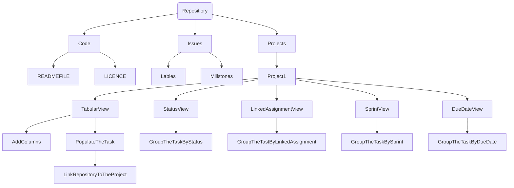

<bg color = FFFF>
# CMPG-323-Overview-36627399
This repository will hold information about the due dates of assignment and time taken to complete them

 
### Repositories that will be created for each projects
1) CMPG 323 Overview-36627399: is the respository for first project which is Agile and Scrum 
2) CMPG 323 Project 2-36627399: is the repository for the second project which is API Development 
3) CMPG 323 Project 3-36627399: is the repository for the third project which is Standards and Patterns 
4) CMPG 323 Project 4-36627399: is the repository for the fourth project which is Testing and RPA 
5) CMPG 323 Project 5-36627399: is the repository for the fifth project which is Reporting and Monitoring 

 
### Digram showing how the project will be broken down 

In the current repository I make use of Code, Issues and Project tab which they consists of what is needed on the project. After creating a project, I created the views and porpulate the task to tabular view. The link the repository to the project. 
