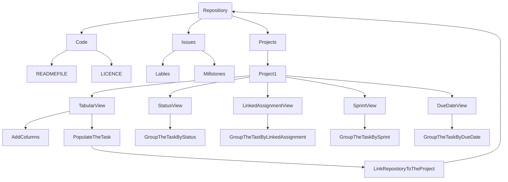

# CMPG-323-Overview-36627399
This repository will hold information about the due dates of assignment and time taken to complete them

  
### Repositories that will be created for each projects
1) CMPG 323 Overview-36627399: is the respository for first project which is Agile and Scrum 
2) CMPG 323 Project 2-36627399: is the repository for the second project which is API Development 
3) CMPG 323 Project 3-36627399: is the repository for the third project which is Standards and Patterns 
4) CMPG 323 Project 4-36627399: is the repository for the fourth project which is Testing and RPA 
5) CMPG 323 Project 5-36627399: is the repository for the fifth project which is Reporting and Monitoring 

### Digram showing how the project will be broken down 
 

In the current repository I make use of Code, Issues and Project tab which they consists of what is needed on the project. After creating a project, I created the views and porpulate the task to tabular view. The link the repository to the project. 

  
### Branching Stratage

 
Project 1: I will be using GitHub Flow Stratage where by the Overview repository will be updated as time goes on(meaning Project 1 is the backbone of other projects and if there is need for changes in the main branche or on Kanban project its self will use GitHub Flow Stratage to help updating the entire repository
Project 2: I will be using GitHub Flow Stratage, any changes that need to made user can use another branch to deploy changes or just commit straight to the Main branch
Project 3: I will be using Git Flow Stratage, because it will consists of Main and Develop Branches as active branches and other branches that will fix the bugs(Hotfix), if there is new changes to be main in the repository Feature branch/Release can be use to do the updates on the repository
Project 4 and 5: I will be using Trunk Based Development Stratage, where by all the changes are push directly to the Master/Main branch

 
### .GitIgnore file
It is a file that as user you dont want commit it again and again if you have commit it in the past. Or is the file that contain secret information and you dont want other user to get hold of it as "privacy control"-protecting valueable information.Project 1 there is no gitignore file needed, because there is no file containing sensitive information. Project 2 will ignore database file(which will contain user information that will be use for authentication mechanism). Project 3 will ignore file that contain data source,Visual Code Studio file thata contain connection string also the classes that contain the data retrived from data source if it contain information that is sensitive. Project 4 will ignore the file that contain input data(user information is the top priority for the develop not be leaked to the wrong hands. Project 5 ignore the Visual Code Studio file that contain string connection to the data source and also the file that contain data source. With what being said above the use of .gitignore will help to restric other user from get hold of valuable information in each project. Since the repository is public every one can access it and it is paramount to protect file with sensitive information.

### Storage of Credatial and Sensitive Information
For security purpose sensitive data e.g. user input data cannot be store to the database as plain text. The reason is to protect data from withing and to the outside world is of important. Storing data should be encrypted using any Cipher that can be decrypted back to its plan text. This will resolve the issue of inside theft(meaning someone from the company can give information of the company to other people, but if its encrypted company is safe). In practicing good data storage, storing one copy of file is not a good thing if the file get lost but storing into to multiple place can help. Storing credatials and senstive information to the database, credatial can be use as type of retriving valuable information about the user with giving credatials of the user.
