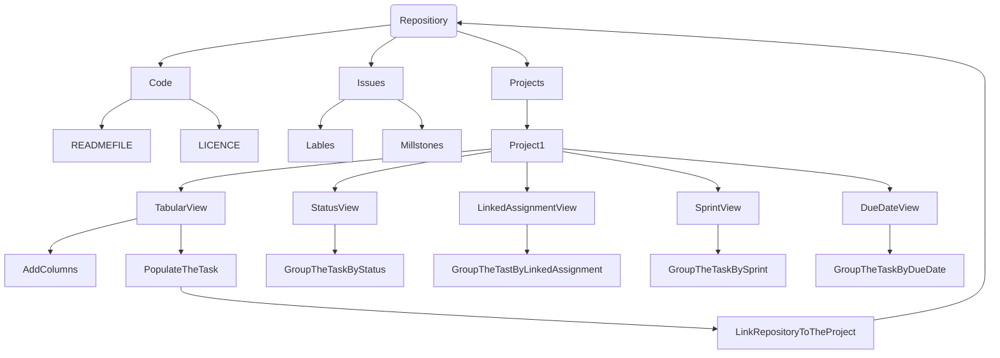

# CMPG-323-Overview-36627399
This repository will hold information about the due dates of assignment and time taken to complete them

  
### Repositories that will be created for each projects
1) CMPG 323 Overview-36627399: is the respository for first project which is Agile and Scrum 
2) CMPG 323 Project 2-36627399: is the repository for the second project which is API Development 
3) CMPG 323 Project 3-36627399: is the repository for the third project which is Standards and Patterns 
4) CMPG 323 Project 4-36627399: is the repository for the fourth project which is Testing and RPA 
5) CMPG 323 Project 5-36627399: is the repository for the fifth project which is Reporting and Monitoring 

### Digram showing how the project will be broken down 
 

CMPG323 Overview Repository contains the Code, Issues, Insights, and Projects tabs, which contain what is required for the project. The code tap consists of a new file added to the Main branch, a README file that contains an overview of the project, and a LICENCE file that specifies what type of LICENCE the repository uses. Issues tap has labels and milestones, where labels classify the class to which the task belongs and milestones provide the deadlines for each project. My Kanban project is accessible through the projects tab. Then there was the report about data (data visualization) meaning chats, which we discovered on the insight tab. All of this is integrated into the project by linking the repository to the project.

  
### Branching Stratage

 
Project 1: I will use GitHub Flow Strategy to update the Overview repository as time passes (meaning Project 1 is the backbone of other projects and if there is a need for changes in the main branch or on the Kanban project itself, I will use GitHub Flow Stratage to help updating the entire repository).
Project 2: I'll be using GitHub Flow Strategy, and if any changes need to be made, the user can use another branch to deploy changes or simply commit to the Main branch.
Project 3: I will use the Git Flow Strategy because it will include Main and Develop Branches as active branches, as well as other branches that will fix bugs (Hotfix) if there are new changes to the repository's main branch. To update the repository, use Feature branch/Release.
Projects 4 and 5: I plan to use a Trunk Based Development Strategy, with all changes pushed directly to the Master/Main branch.

 
### .GitIgnore file
It is a file that you as a user do not want to commit again and again if you have already committed it. Or is it a file containing secret information that you do not want other users to have access to as "privacy control"-protecting valuable information? Because there is no file containing sensitive information in Project 1, no gitignore file is required. Project 2 will disregard the database file (which will contain user information that will be use for authentication mechanism). Project 3 will ignore files that contain data sources, Visual Code Studio files that contain connection strings, and classes that contain data retrieved from data sources if they contain sensitive information. Project 4 will ignore files containing input data (user information is a top priority for the development not to fall into the wrong hands). Project 5 ignores the Visual Code Studio file containing the string connection to the data source as well as the file containing the data source. As previously stated, the use of Gitignore will assist in preventing other users from gaining access to valuable information in each project. Because the repository is open to the public, anyone can access it, so it is critical to protect files containing sensitive information.

### Storage of Credatial and Sensitive Information
Sensitive data, such as user input data, cannot be stored in the database as plain text for security reasons. The reason for this is that protecting data from within and from the outside world is critical. Data storage should be encrypted with any Cipher that can be decrypted back to plain text. This will put an end to the problem of inside theft (meaning someone from the company can give information of the company to other people, but if its encrypted company is safe). When it comes to good data storage, keeping only one copy of a file is not a good idea if the file is lost, but keeping multiple copies can help. Credentials and sensitive information are stored in the database. Credentials can be used to retrieve valuable information about the user by providing the user's credentials.
