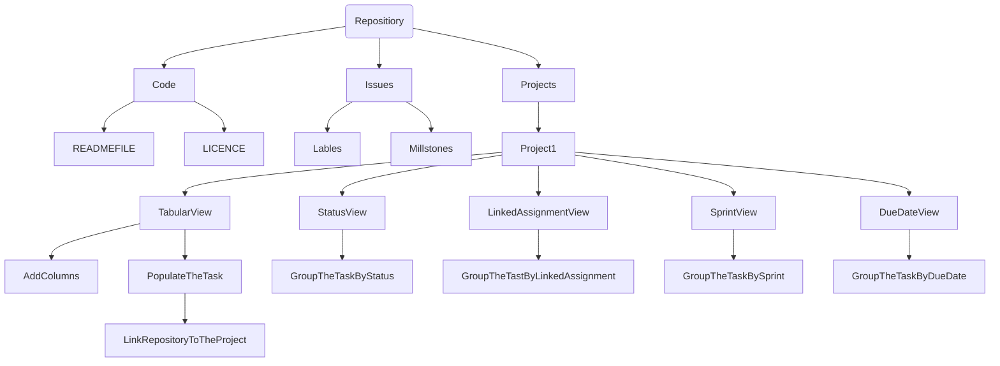

<bg color = FFFF>
# CMPG-323-Overview-36627399
This repository will hold information about the due dates of assignment and time taken to complete them
<hr color= red>
  
### Repositories that will be created for each projects
1) CMPG 323 Overview-36627399: is the respository for first project which is Agile and Scrum<br>
2) CMPG 323 Project 2-36627399: is the repository for the second project which is API Development<br>
3) CMPG 323 Project 3-36627399: is the repository for the third project which is Standards and Patterns<br>
4) CMPG 323 Project 4-36627399: is the repository for the fourth project which is Testing and RPA<br>
5) CMPG 323 Project 5-36627399: is the repository for the fifth project which is Reporting and Monitoring<br>
<hr color = red>

### Digram showing how the project will be broken down<br>
 

In the current repository I make use of Code, Issues and Project tab which they consists of what is needed on the project. After creating a project, I created the views and porpulate the task to tabular view. The link the repository to the project. 
<hr color="red">
  
### Branching Stratage

```mermaid
  graph TB;
      ProjectBranching-->CMPG323Overview;
      ProjectBranching-->CMPG323Project2;
      ProjectBranching-->CMPG323Project3;
      ProjectBranching-->CMPG323Project4;
      ProjectBranching-->CMPG323Project5;
      CMPG323Overview-->MainBranch;
      CMPG323Project2-->MainBranch;
      CMPG323Project3-->MainBranch;
      CMPG323Project3-->DevelopBranch;
      CMPG323Project3-->HotFixBranch;
      CMPG323Project4-->MainBranch;
      CMPG323Project5-->MainBranch;
  ```
 
Project 1,2,4,5 have one branch which is main and project 3 there 3 branches main,hotFix,develop respectively. Hotfix branch is project will fix and bring the changes to main branch.
<hr color="red">
 
### .GitIgnore file
It is a file that as user you dont want commit it again and again if you have commit it in the past. Or is the file that contain secret information and you dont want other user to get hold of it as "privacy control"-protecting valueable information.Project 1 there is not gitignore file needed,
