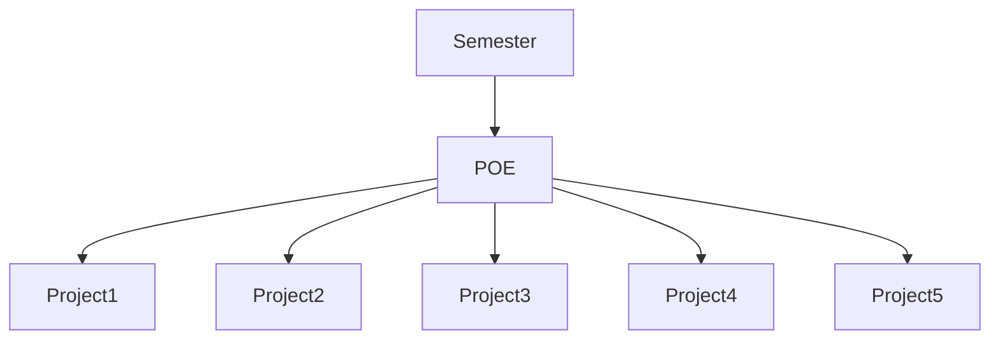

<h1>CMPG-323-Overview-36627399</h1>
This repository will hold information about the due dates of assignment and time taken to complete them

### Repositories that will be created for each projects
1) CMPG 323 Overview-36627399: is the respository for first project which is Agile and Scrum 
2) CMPG 323 Project 2-36627399: is the repository for the second project which is API Development 
3) CMPG 323 Project 3-36627399: is the repository for the third project which is Standards and Patterns 
4) CMPG 323 Project 4-36627399: is the repository for the fourth project which is Testing and RPA 
5) CMPG 323 Project 5-36627399: is the repository for the fifth project which is Reporting and Monitoring 

### Digram showing how the project will be broken down 

CMPG323 Overview Repository contains the Code, Issues, Insights, and Projects tabs, which contain what is required for the project. The code tap consists of a new file added to the Main branch, a README file that contains an overview of the project, and a LICENCE file that specifies what type of LICENCE the repository uses. Issues tap has labels and milestones, where labels classify the class to which the task belongs and milestones provide the deadlines for each project. My Kanban project is accessible through the projects tab. Then there was the report about data (data visualization) meaning chats, which we discovered on the insight tab. All of this is integrated into the project by linking the repository to the project.

  
### Branching Stratage

For each project, I'll use the GitHub Flow Strategy, which will allow me to create branches if I want to update or fix a bug from the repository before merging back to the main branch or just committing straight to the main. This strategy will keep the main branch deployable while allowing the update or fix branches to work independently before merging back into the main.

 
### .GitIgnore file
It is a file that you as a user do not want to commit again and again if you have already committed it or it is a file containing secret information that you do not want other users to have access to as "privacy control"-protecting valuable information.Project 1, no gitignore file is required. Project 2 will use gitignore to ignore the database file (which will contain user information that will be use for authentication mechanism). Project 3 will ignore files that contain data sources, Visual Code Studio files that contain connection strings, and classes that contain data retrieved from data sources if they contain sensitive information. Project 4 will ignore files containing input data (user information is a top priority for the development not to fall into the wrong hands). Project 5 ignores the Visual Code Studio file containing the string connection to the data source as well as the file containing the data source. As previously stated, the use of Gitignore will assist in preventing other users from gaining access to valuable information in each project. Because the repository is open to the public, anyone can access it, so it is critical to protect files containing sensitive information.

### Storage of Credatial and Sensitive Information
Sensitive data, such as user input data, cannot be stored in the disk as plain text for security reasons. The reason for this is that protecting data from within and from the outside world is critical. Data storage should be encrypted with any Cipher that can be decrypted back to plain text. This will put an end to the problem of inside theft (meaning someone from the company can give information of the company to other people, but if its encrypted company is safe). When it comes to good data storage, keeping only one copy of a file is not a good idea if the file is lost, but keeping multiple copies can help.I be using git-credential-store to store credentials on disk.

### Projects Structure for the Semester

POE will integrate all the project for the Exam purpose.

### Due Date View
Summerize the due dates of the work to do and the work done

### Effort Hours View 
Summarize the hours for each sprint(2 weeks), off which each week takes 11 hours. By adding the hours in each sprint and divide by 2 will show hours per week
